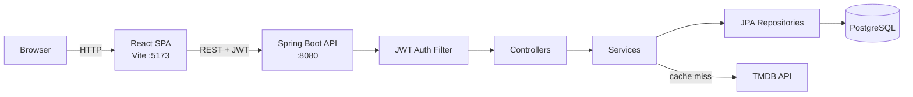

<div align="center">

# 🎬 Verdix

**A full-stack movie review platform. Log the films you watch, rate them, and see what other people think.**


</div>

<!-- add screen shots or maybe a short demo -->

---

## Table of Contents

- [Overview](#overview)
- [Features](#features)
- [Tech Stack](#tech-stack)
- [Architecture](#architecture)
- [Getting Started](#getting-started)
- [API Reference](#api-reference)
- [Testing](#testing)
- [Project Structure](#project-structure)
- [Roadmap](#roadmap)
- [License](#license)

---

## Overview

Verdix is a social movie logging app inspired by the rating system used on food-review app Beli. Users create an account, search a catalog of movies backed by [The Movie Database (TMDB)](https://www.themoviedb.org/), and write reviews with the date they watched the film. As for the ratings, thats where the magic happens. Every rating is compared against previously watched movies to determine the best of the best.

The project has two parts:

- A **Spring Boot REST API** that handles stateless JWT authentication, user and review management, and an on-demand cache of TMDB movie data in PostgreSQL.
- A **React + TypeScript single-page app** with a cinematic dark UI, built with Vite and Tailwind CSS.

## Features

### Backend
- **JWT authentication.** Registration and login issue signed tokens (JWT). A custom `OncePerRequestFilter` validates tokens on each request, so the API keeps no server-side sessions.
- **Secure password storage.** Passwords are hashed with BCrypt through Spring Security's `DaoAuthenticationProvider`.
- **Resource ownership checks.** Only the author of a review can edit or delete it. Anyone else gets a `403 Forbidden`.
- **Lazy TMDB caching.** The first time a movie is requested, its details are fetched from TMDB and saved locally. Later requests are served from PostgreSQL, which reduces external API calls and latency.
- **Input validation.** Bean Validation runs on every request DTO: ratings must be 1–10, usernames 3–20 characters, emails must be valid, and so on.
- **Consistent error handling.** A global `@RestControllerAdvice` turns exceptions into clean JSON error responses.
- **Pagination and sorting** on all list endpoints through Spring Data `Pageable`.
- **Interactive API docs** generated with springdoc-openapi (Swagger UI), with Bearer-token support built in.

### Frontend
- **Auth flow.** A React Context manages the session. An Axios interceptor attaches the JWT to every outgoing request.
- **Type-safe forms** using React Hook Form with Zod schema validation.
- **Responsive, accessible UI.** Built mobile-first with Tailwind CSS v4, semantic markup, and ARIA labels.
- **Home page** with a hero section for the trending movie, recently reviewed films, and top reviewers.

## Tech Stack

| Layer | Technologies |
|---|---|
| **Backend** | Java 21, Spring Boot 4, Spring Security, Spring Data JPA / Hibernate, JJWT, Lombok |
| **Database** | PostgreSQL 18 (Docker), H2 (in-memory, for tests) |
| **Frontend** | React 19, TypeScript, Vite, Tailwind CSS 4, React Router 7, React Hook Form, Zod, Axios, Lucide icons |
| **API Docs** | springdoc-openapi / Swagger UI |
| **Testing** | JUnit 5, Mockito, Spring MockMvc, Spring Security Test |
| **Tooling** | Gradle, Docker Compose, ESLint |
| **External API** | TMDB API v3 |

## Architecture



The backend is organized **by feature** (`movie`, `review`, `user`, `security`) rather than by technical layer. Each feature package contains its own controller, service, repository, and DTOs, which keeps related code together and makes each feature easy to work on independently.

**Movie lookup flow:** `GET /api/movies/{tmdbId}` first checks PostgreSQL for the movie. On a cache miss, `TmdbClient` fetches the details from TMDB, maps them to a `Movie` entity, saves it, and returns it. Creating a review uses the same path, so every reviewed movie is guaranteed to exist locally.

---

## Getting Started

### Prerequisites

| Tool | Version | Notes |
|---|---|---|
| [JDK](https://adoptium.net/) | 21 | Gradle uses a toolchain, so JDK 21 must be installed |
| [Node.js](https://nodejs.org/) | 20+ | Includes npm |
| [Docker Desktop](https://www.docker.com/products/docker-desktop/) | Latest | Runs PostgreSQL |
| TMDB API key | — | Free. Create an account, then go to **Settings → API** and copy the **API Read Access Token** |

### 1. Clone the repository

```bash
git clone https://github.com/timliiang/Verdix.git
cd Verdix
```

### 2. Configure backend environment variables

Copy the example file and fill in your values:

```bash
cp backend/.env.example backend/.env
```

```properties
POSTGRES_USER=postgres
POSTGRES_PASSWORD=choose_a_password
POSTGRES_DB=movie_review_app          # must be exactly this; the JDBC URL expects it

JWT_SECRET=<64+ character hex string> # see below
JWT_EXPIRATION=86400000               # token lifetime in ms (24h)

TMDB_READ_ACCESS_TOKEN=<your TMDB read access token>
TMDB_BASE_URL=https://api.themoviedb.org/3/
```

Generate a secure JWT secret with:

```bash
openssl rand -hex 32
```

> **Note:** Two different processes read this file from two different places. Docker Compose reads `backend/.env`. Spring Boot reads `.env` at the **repository root**, resolved as `../.env` relative to `backend/`. Until that is unified, copy the file to the root as well:
>
> ```bash
> cp backend/.env .env
> ```

### 3. Start the database

```bash
docker compose up -d db
```

This starts PostgreSQL 18 on `localhost:5432` and stores its data in a named Docker volume (`db-data`), so the data survives restarts.

### 4. Run the backend

```bash
cd backend
./gradlew bootRun        # macOS / Linux
gradlew.bat bootRun      # Windows
```

The API runs on **http://localhost:8080**. Hibernate creates the database tables automatically on first start (`ddl-auto=update`).

Interactive API docs are available at **http://localhost:8080/swagger-ui.html**.

### 5. Run the frontend

In a new terminal:

```bash
cd frontend
cp .env.example .env
```

Set the API URL in `frontend/.env`:

```properties
VITE_API_BASE_URL=http://localhost:8080
```

Then install dependencies and start the dev server:

```bash
npm install
npm run dev
```

Open **http://localhost:5173**.

### Trying the API with Swagger

1. Open http://localhost:8080/swagger-ui.html.
2. Call `POST /api/auth/register` with a username, email, and password.
3. Copy the `token` from the response.
4. Click **Authorize** at the top of the page and paste the token.
5. Every protected endpoint is now available. For example, try `GET /api/movies/search?query=inception`.

### Troubleshooting

| Problem | Fix |
|---|---|
| `Could not resolve placeholder 'POSTGRES_USER'` | Spring can't find the root `.env`. Check that `.env` exists at the repo root and that you started the app from inside `backend/`. |
| `database "movie_review_app" does not exist` | `POSTGRES_DB` must be `movie_review_app`. If you changed it, run `docker compose down -v` to wipe the volume and start again. |
| Port `5432` already in use | A local PostgreSQL is already running. Stop it, or change the host port in `docker-compose.yml` and in `spring.datasource.url`. |
| `401 Unauthorized` on every request | Every route except `/api/auth/**` and the Swagger docs requires a `Bearer` token. |
| CORS errors in the browser | The API only allows `http://localhost:5173`. Run Vite on its default port. |

---

## API Reference

Every endpoint except `/api/auth/**` requires an `Authorization: Bearer <token>` header.

### Auth
| Method | Endpoint | Description |
|---|---|---|
| `POST` | `/api/auth/register` | Create an account and receive a JWT |
| `POST` | `/api/auth/login` | Log in and receive a JWT |

### Movies
| Method | Endpoint | Description |
|---|---|---|
| `GET` | `/api/movies/search?query=&page=` | Search TMDB |
| `GET` | `/api/movies/{tmdbId}` | Get movie details (from the local cache, or fetched from TMDB) |
| `GET` | `/api/movies?page=&size=&sort=` | List cached movies (paginated, sorted by title by default) |

### Reviews
| Method | Endpoint | Description |
|---|---|---|
| `POST` | `/api/reviews` | Create a review |
| `PUT` | `/api/reviews/{id}` | Update a review (author only) |
| `DELETE` | `/api/reviews/{id}` | Delete a review (author only) |
| `GET` | `/api/reviews/user/{userId}` | A user's reviews (paginated) |
| `GET` | `/api/reviews/movie/{movieId}` | A movie's reviews (paginated) |

### Users
| Method | Endpoint | Description |
|---|---|---|
| `GET` | `/api/users/me` | The authenticated user's profile |
| `GET` | `/api/users/{id}` | A user's public profile |

<details>
<summary><b>Example: create a review</b></summary>

```http
POST /api/reviews
Authorization: Bearer eyJhbGciOi...
Content-Type: application/json

{
  "tmdbId": 27205,
  "rating": 9,
  "reviewText": "A dream within a dream, and it still holds up.",
  "watchedDate": "2026-09-20"
}
```

`rating` is an integer from 1 to 10. `reviewText` can be up to 1000 characters and may be an empty string.
</details>

---

## Testing

The backend has unit tests and web-layer tests. They run against an in-memory **H2** database with a test JWT secret, so they need no Docker, `.env`, or TMDB key.

```bash
cd backend
./gradlew test
```

| Suite | What it covers |
|---|---|
| `AuthServiceTest` / `AuthControllerTest` | Registration, login, duplicate-user handling, request validation |
| `ReviewServiceTest` / `ReviewControllerTest` | CRUD, ownership checks, validation errors, status codes |
| `MovieServiceTest` | Cache hit vs. TMDB fetch, entity mapping |

Frontend linting:

```bash
cd frontend
npm run lint
```

---

## Project Structure

```
.
├── backend/                         # Spring Boot REST API
│   └── src/main/java/io/github/timliiang/
│       ├── common/                  # CORS, app config, global exception handling
│       ├── movie/                   # Movie entity, service, controller
│       │   └── tmdb/                # TMDB HTTP client and response records
│       ├── review/                  # Review CRUD and DTOs
│       ├── security/                # JWT provider/filter, auth endpoints, security config
│       └── user/                    # User entity and profile endpoints
├── frontend/                        # React + TypeScript SPA
│   └── src/
│       ├── api/                     # Axios instance (JWT interceptor) and API calls
│       ├── components/              # Home page and layout components
│       ├── context/                 # AuthContext (session state)
│       ├── pages/                   # Route-level pages
│       ├── schemas/                 # Form validation schemas
│       └── types/                   # Shared TypeScript types
└── docker-compose.yml               # PostgreSQL service
```

---

## Roadmap

Verdix is under active development. Planned work:

- [ ] Connect the home page to live API data (it currently uses mock data)
- [ ] Movie detail page with reviews and a review form
- [ ] Register route and public profile pages in the frontend
- [ ] Follow other users and see a personalized activity feed
- [ ] Containerize the full stack with Docker Compose (API + frontend + DB)
- [ ] CI pipeline with GitHub Actions (build, test, lint)
- [ ] Database migrations with Flyway
- [ ] Cloud deployment

## License

Distributed under the Apache 2.0 License. See [`LICENSE`](LICENSE) for details.

---

<div align="center">

*This product uses the TMDB API but is not endorsed or certified by TMDB.*

</div>
